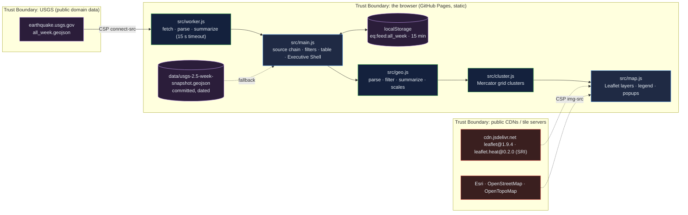

# Global Earthquake Visualization: a week of USGS seismicity, clustered, filtered, and honest about where the data came from

[](https://github.com/Freddricklogan/earthquake-visualization/actions/workflows/deploy.yml)
[](#5-getting-started--verification)
[](https://github.com/Freddricklogan/earthquake-visualization/actions/workflows/codeql.yml)
[](LICENSE)
[](https://freddricklogan.github.io/earthquake-visualization/)

## 1. Executive Summary & Business Impact

**Problem statement.** A "live" map is only as trustworthy as its
fallbacks. The previous version of this page drew every one of ~2,000
weekly events as an overlapping circle, fetched on the main thread with no
cache or timeout, offered a backup that pointed at a branch that does not
exist, and — since CARTO began requiring an API key — rendered every tile
with the words "API KEY REQUIRED" (`AUDIT.md`).

**Solution & value delivered.** The page fetches the USGS seven-day
GeoJSON feed in a Web Worker, caches it for fifteen minutes, and falls back
to a dated snapshot committed in the repository, always stating which
source is on screen and when the feed was generated. Events are clustered
in tile space below zoom 7 (a pure, tested grid clusterer), coloured by
depth and sized by magnitude with a zoom-aware scale, filterable by
magnitude, window and depth, with a heat layer and plate boundaries. A
table of the strongest events with a Show button per row makes the data
reachable without the map. Strict CSP, pinned libraries with SRI, no
`innerHTML` from feed fields.

**[→ Read the full case study](docs/CASE_STUDY.md)**

| Outcome | How this repo delivers it |
| --- | --- |
| Survives a slow or absent USGS | Worker fetch with a 15 s timeout → localStorage cache (15 min) → committed snapshot, each named in the status line |
| Readable at every zoom | Grid clustering below zoom 7 with count bubbles; marker radius scales with zoom |
| Reachable without a pointer | Strongest-events table with Show buttons; keyboard-focusable clusters; labelled filters; `aria-live` status |
| Basemaps that render | Esri Dark Gray default (no key), OpenStreetMap, OpenTopoMap, Esri imagery; CSP `img-src` lists exactly these hosts |
| Tested where it can be | 12 tests over parsing, filters, summaries, clustering and formatting, including the committed USGS snapshot |

## 2. Demonstrated Competencies & Technical Skills

- **Data Science & AI** — GeoJSON normalisation with explicit rejection
  counts, depth and magnitude binning, per-day counts, median depth,
  Web-Mercator projection and grid clustering with conservation tests.
- **Systems Architecture & CS** — module Web Worker with timeout, cache
  policy as a pure function, source fallback chain, Leaflet wiring kept
  separate from computation.
- **Cybersecurity & Compliance** — `default-src 'none'`, `connect-src`
  limited to USGS, SRI computed against the artifacts, `textContent` for
  every feed field, CodeQL and Trivy in CI.
- **EdTech & Human-Centered Design** — the tour goes from clusters to
  filters to plate boundaries to the table, and the page names its data
  source and age at all times.

## 3. System Architecture & Data Flow



No backend, no account, no telemetry. The only outbound requests are the USGS feed, the pinned libraries and map tiles.

## 4. Technical Highlights & Engineering Decisions

### ADR-1 — A source chain that names itself

**Context.** The old backup pointed at a missing branch and the UI said
"Live" regardless.

**Decision.** Live (worker, 15 s timeout) → cached (15 min, `isFresh()`
tested) → committed snapshot. The status line and a KPI show the source
and the feed's own `metadata.generated` time.

**Consequence.** The page never lies about freshness and works offline
from the snapshot; a reviewer can see which case they are looking at.

### ADR-2 — Write the clusterer instead of adding a plugin

**Context.** Leaflet.markercluster is fine, but a third-party cluster
cannot be unit-tested for conservation and adds another CDN dependency.

**Decision.** `clusterEvents()` buckets events by Web-Mercator grid cell at
the current zoom (48 px cells) and returns count, centroid and strongest
event; tests assert every event lands in exactly one cluster and that
higher zoom yields more clusters.

**Consequence.** Deterministic, ~40 lines, no dependency, and the
threshold zoom is a tested constant rather than plugin behaviour.

### ADR-3 — Drop D3, pin Leaflet, list the tile hosts

**Context.** D3 was loaded (~280 kB) for one `d3.json` call; libraries
came from unpkg without integrity; CARTO tiles now need a key.

**Decision.** `fetch` replaces D3; Leaflet and leaflet.heat are pinned on
jsDelivr with SRI and vendored; Esri Dark Gray replaces CARTO; the CSP
`img-src` names the four tile hosts and nothing else.

**Consequence.** One fewer library, a verifiable supply chain, and tiles
that render.

## 5. Getting Started & Verification

**Prerequisites.** Node 22 LTS. No build step; the page is served from the
repository root.

```bash
git clone https://github.com/Freddricklogan/earthquake-visualization.git
cd earthquake-visualization
npm ci
npm run lint && npm run validate && npm run coverage
npx serve .    # open http://localhost:3000
```

To refresh the fallback snapshot: `curl -sL https://earthquake.usgs.gov/earthquakes/feed/v1.0/summary/2.5_week.geojson -o data/usgs-2.5-week-snapshot.geojson`.

**Verification — the numbers this repository actually produced:**

```bash
npm run coverage   # 12 passed / 12; All files 97.82% stmts, 90.47% branches
npm run lint       # 0 problems
npm run validate   # html-validate index.html: clean
```

| Check | Result |
| --- | --- |
| Unit tests (Vitest) | **12 passed / 12** across 3 files |
| Coverage (pure modules) | **97.82%** statements, **90.47%** branches (`main.js`, `map.js`, `worker.js` covered by the browser smoke test) |
| ESLint, html-validate | clean |
| Committed snapshot | USGS M2.5+ past week, generated 2026-09-21 03:57 UTC, 346 features |
| Headless Chrome smoke (2026-09-21) | **0 console errors**; live feed 1,878 events, 1,798 in the 7-day window; strongest M 6.5 near Nikolski, Alaska; 41 clusters at zoom 2; M≥4.5 filter → 112; heat and plate layers toggle; table Show opens the popup; five tour steps; no horizontal scroll at 1280 or 400 px |

The event counts above are what the live feed returned on that date; they change hourly.

## 6. Live Demo & Production Showcase

**<https://freddricklogan.github.io/earthquake-visualization/>**

**30-second guided walkthrough.** Press **Take the 30-second tour**.

1. **A week of earthquakes, clustered** — count bubbles at low zoom.
2. **Filter to what matters** — magnitude floor to 4.5.
3. **Heat and plate boundaries** — why the clusters sit where they do.
4. **Strongest events, reachable by keyboard** — Show pans and opens.
5. **Where the data came from** — live, cached, or snapshot, with the time.

Earthquake data: USGS Earthquake Hazards Program (public domain). Plate boundaries: Bird (2003) via fraxen/tectonicplates.
